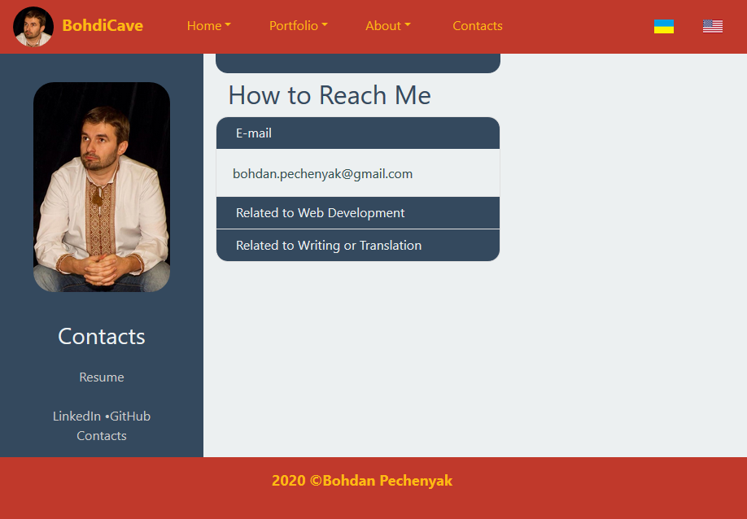

# GitHub Portfolio - Профільна сторінка на GitHub з портфелем проєктів

A bilingual (English/Ukrainian) GitHub portfolio page powered by React.js, including a brief bio and contact information.

Showcasing a portfolio of projects using:

* HTML, CSS, Javascript
  * semantic HTML web pages
  * styled with CSS3, literally deployed in figuratively cascading levels of 
        a. Bootstrap, Milligram.io and other frameworks,
        b. own styles, and
        c. occasional inline CSS
  * powered by JS (React.js framework)
* Includes various projects 
  * frontend (weather dashboard, investment research, password generator, JS quiz) 
  * backend/full-stack (CLI-based apps, HTML and README generators, and full-stack projects using MySQL or MongoDB and Node-Express.js servers)

## Link

[BohdiCave GitHub Portfolio Page](https://bohdicave.github.io/)

[Сторінка портфоліо - веб-розробник BohdiCave](https://bohdicave.github.io/index-ua.html)

## Screenshots

### Home page - English version

### Домашня сторінка - українська версія

### Portfolio page - English version

### Портфельна сторінка - українська версія

### Contacts page

