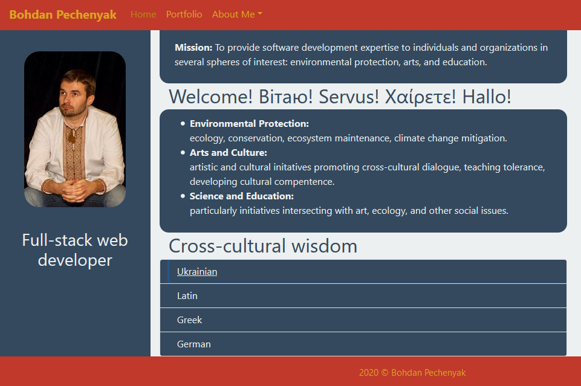
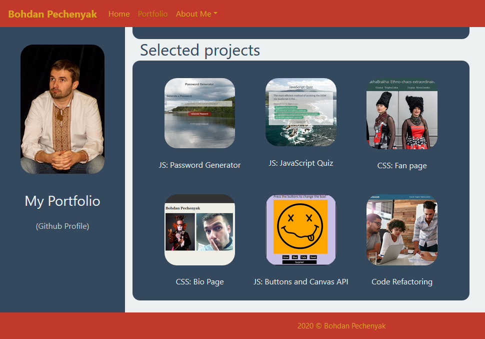

# Github Profile Page - bohdicave.github.io

Web developer portfolio page with brief bio and contact information.
Showcasing a portfolio of projects using:
* HTML - classic and semantic 
* CSS - literally, in figuratively cascading levels of Bootstrap, own CSS file, and occasional inline styling.
* JavaScript - various projects (password generator, JS quiz, Canvas API and more)

# Link to the Home page

[GitHub Pages](https://bohdicave.github.io/)

# Screenshots:

