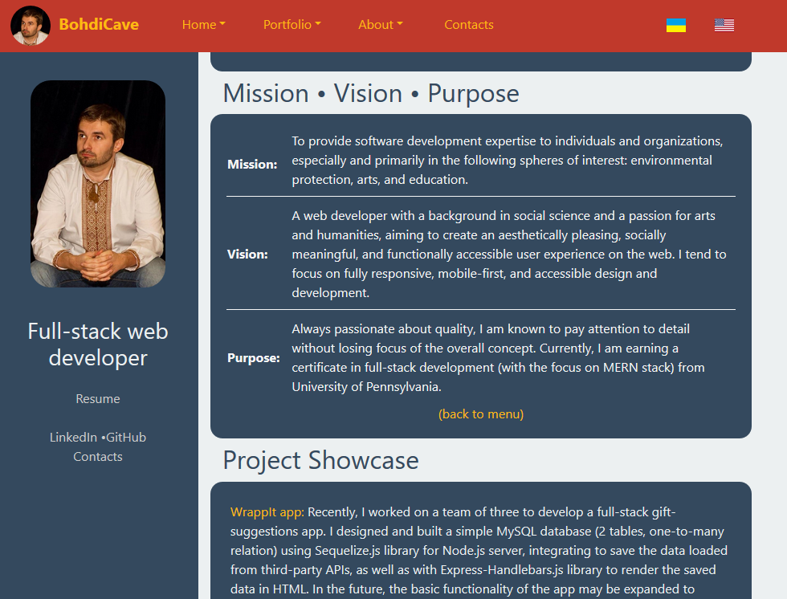
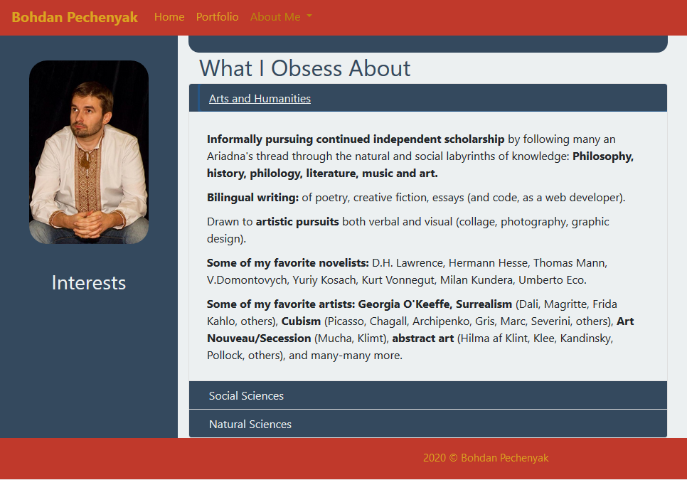
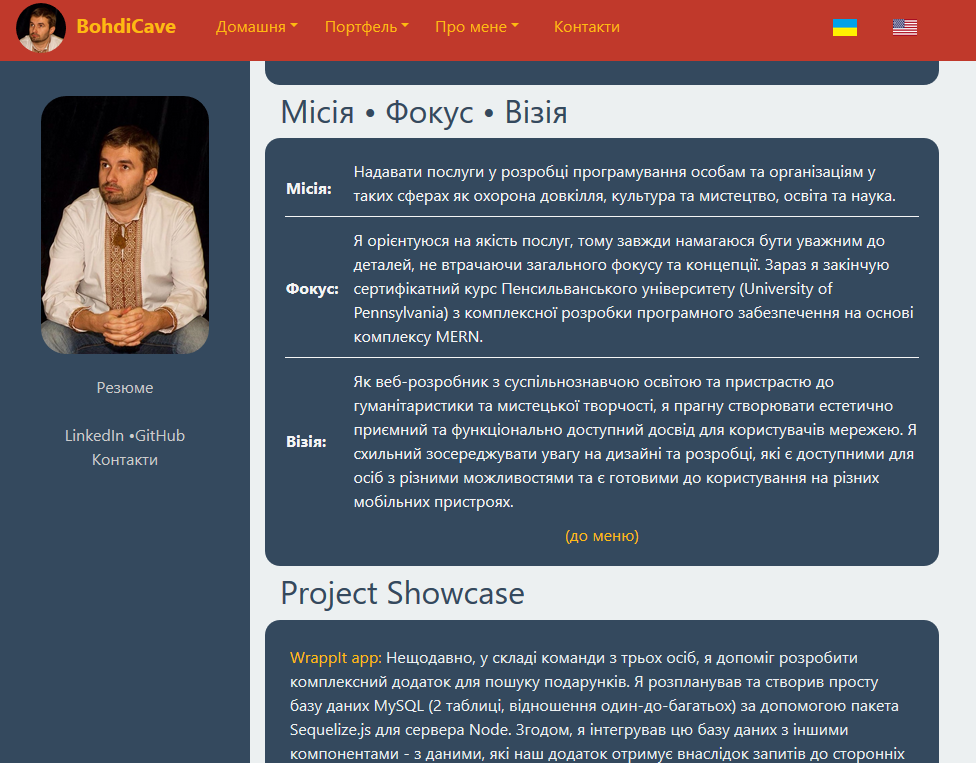
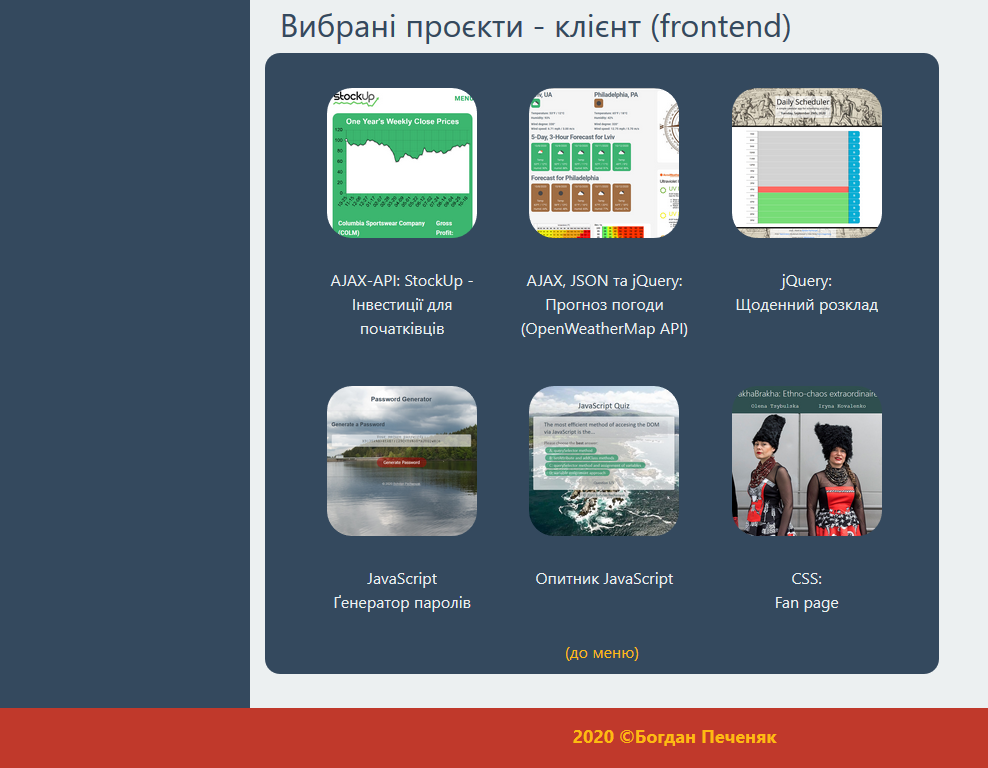
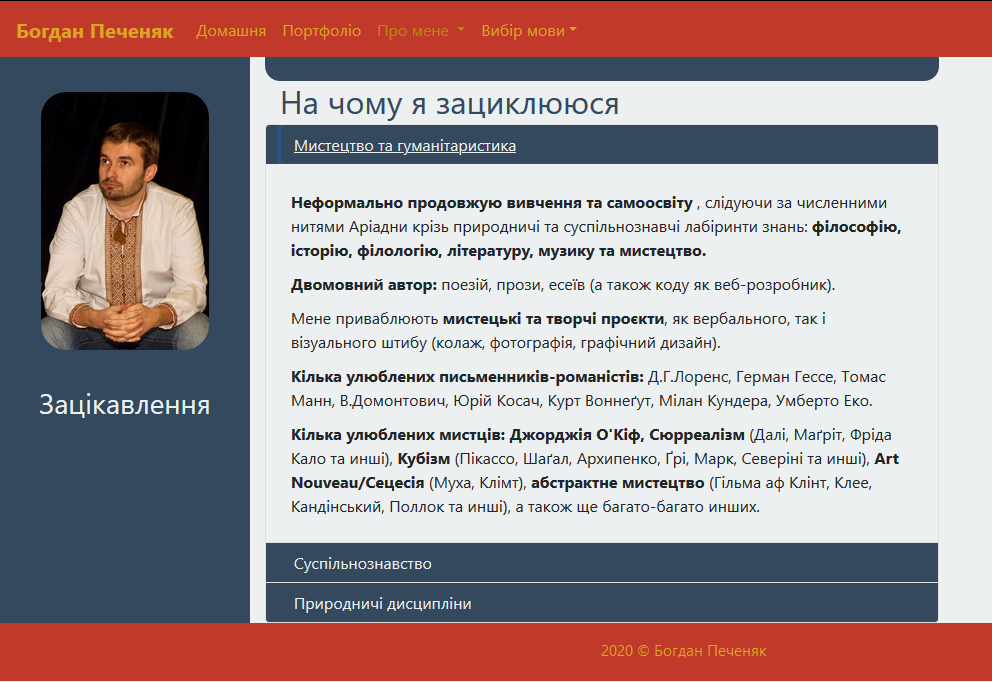
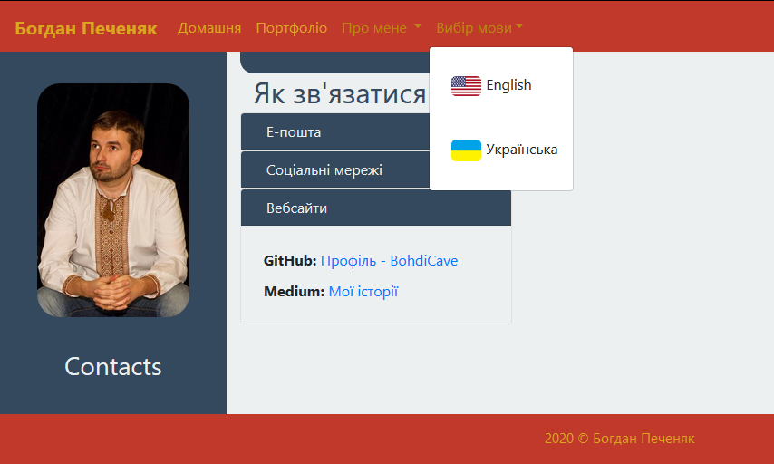

# GitHub Portfolio Page - Сторінка Портфоліо

A bilingual (English and Ukrainian) web developer portfolio page, created using React.js.

Showcasing a portfolio of projects using:

* HTML - both classic and semantic
* CSS - literally deployed in figuratively cascading levels of Bootstrap, own CSS file, and occasional inline styling.
* JavaScript - various projects (weather dashboard, investment research, password generator, JS quiz, and more)

## Link to the finished product - Завершений продукт

[BohdiCave GitHub Portfolio Page](https://bohdicave.github.io)

(The below link is temporarily unavailable) 
[Сторінка портфоліо - веб-розробник Богдина Печерний (BohdiCave)](https://bohdicave.github.io/index-ua.html)

## Screenshots

### English version - Англійський варіант

### Український варіант - Ukrainian version

