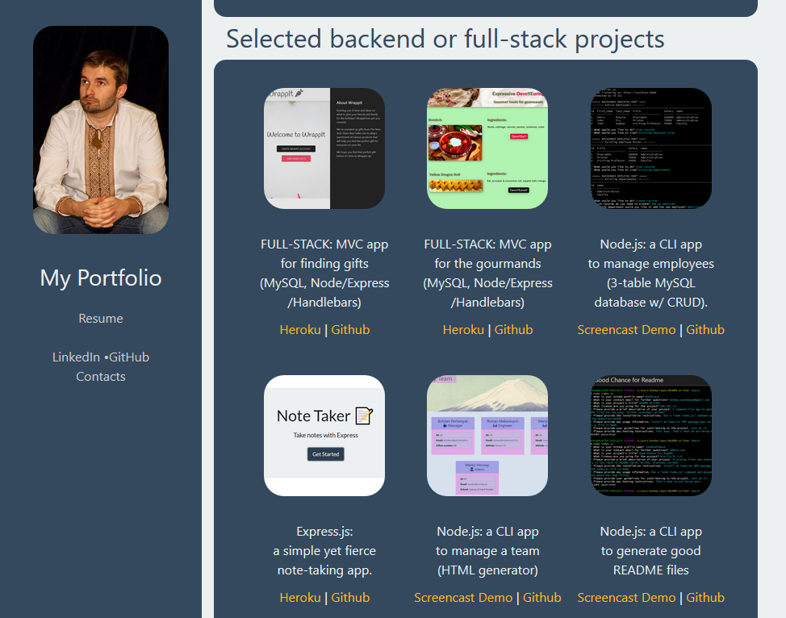

# GitHub Portfolio Page - Сторінка Портфоліо

A bilingual (English and Ukrainian) web developer portfolio page with brief bio and contact information.

Showcasing a portfolio of projects using:
* HTML - both classic and semantic 
* CSS - literally deployed in figuratively cascading levels of Bootstrap, own CSS file, and occasional inline styling.
* JavaScript - various projects (weather dashboard, investment research, password generator, JS quiz)

# Link to the finished product - Завершений продукт

[BohdiCave GitHub Portfolio Page](https://bohdicave.github.io/)

[Сторінка портфоліо - веб-розробник Богдина Печерний (BohdiCave)](https://bohdicave.github.io/index-ua.html)

# Screenshots:

## English version - Англійський варіант

## Ukrainian version - Український варіант

